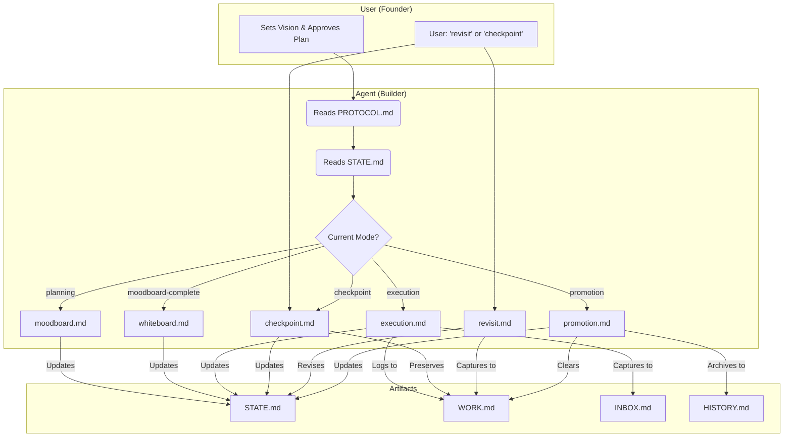

# ⚡ GSD-Lite

**(lite) Get Sh*t Done with AI Agents.**

A minimal, file-based protocol to keep your AI sessions focused, context-aware, and productive.

[](https://pypi.org/project/gsd-lite/)

[Inspired by gsd](https://github.com/glittercowboy/get-shit-done) 

## 🚀 Quick Start

No installation required. Run directly with `uv` (recommended):

```bash
# Initialize a new project
uvx gsd-lite

# Or update an existing one
uvx gsd-lite --update
```

## 🧐 What is this?

**GSD-Lite** is a set of markdown templates that structure your interaction with coding agents (Claude, ChatGPT, Cursor, Windsurf).

Instead of treating the chat as ephemeral, GSD-Lite forces the agent to maintain **persistent state** in your file system. This drastically reduces hallucinations and "context amnesia" during long coding sessions. The protocol is decomposed into a series of workflows, with a main `PROTOCOL.md` file acting as a router.

### The Artifacts

GSD-Lite uses **ultra-trimmed artifacts** optimized for context engineering. Each file is designed to be read quickly by agents (especially weaker models) without overwhelming context windows. This README provides the high-level overview and reasoning that's deliberately omitted from the artifacts themselves.

#### Core Artifacts

| File | Purpose | Why Ultra-Trimmed |
|------|---------|-------------------|
| **`PROTOCOL.md`** | The rulebook and router. The agent reads this first to understand how to behave and which workflow to load. | First file agents read - must be scannable in <10 seconds to determine next action. |
| **`STATE.md`** | The high-level map. Tracks Phase, Current Task, and Key Decisions. | Agents need quick "where are we?" answer without re-reading full session history. |
| **`WORK.md`** | The execution log. Tracks every action, file change, and decision with type-tagged entries. | Detailed but structured - type tags enable grep queries instead of reading entire file. |
| **`INBOX.md`** | The parking lot. Captures scope creep, ideas, and bugs for later phases. | Prevents distraction - agent can capture idea and move on without context switching. |
| **`HISTORY.md`** | The ledger. A permanent record of completed phases. | Archive for reference - rarely read during active work. |

#### Workflow Files

The `workflows/` directory contains step-by-step instructions for different session types. Each workflow is a self-contained recipe that agents follow.

| Workflow | When Used | Agent Actions |
|----------|-----------|---------------|
| **`moodboard.md`** | Start of new phase | Extract user vision through interview, capture preferences, identify references |
| **`whiteboard.md`** | After vision extracted | Present plan for user approval, break into tasks, identify risks |
| **`execution.md`** | Active development | Execute tasks, update WORK.md with progress, capture blockers to INBOX.md |
| **`checkpoint.md`** | End of session (mid-phase) | Update STATE.md, preserve WORK.md, prepare for fresh agent resume |
| **`revisit.md`** | User wants to rethink plan | Review current plan, capture new ideas, compare changes, revise if needed |
| **`promotion.md`** | Phase complete | Extract key outcomes, trim WORK.md, archive to HISTORY.md, clear for next phase |

**Why separate workflows?** Each session type has different goals and artifact updates. Separating them prevents agents from confusing checkpoint (preserve WORK.md) with promotion (trim WORK.md).

## 🔗 How Artifacts Work Together

GSD-Lite is a **coherent system** where each artifact plays a specific role. Here's how they synergize:

### Agent Entry Flow
1. **Agent reads PROTOCOL.md** → Learns routing rules and golden rules
2. **Agent reads STATE.md** → Determines current mode (planning, execution, checkpoint, etc.)
3. **Agent loads workflow file** → Follows step-by-step instructions for that session type
4. **Agent updates artifacts** → STATE.md (where we are), WORK.md (what we did), INBOX.md (what's deferred)

### Session Continuity (The Magic)
**Problem:** AI chat sessions lose context over time. Long projects need multiple sessions.

**Solution:** GSD-Lite uses a **checkpoint → clear → resume** cycle:

1. **Checkpoint** (end of session):
   - Agent updates STATE.md with current progress
   - Agent updates WORK.md Current Understanding section (30-second context summary)
   - WORK.md full log preserved (NOT trimmed)

2. **Clear** (between sessions):
   - You start a fresh chat (or orchestrator spawns fresh agent)
   - Zero context from previous chat
   - Clean slate, no context rot

3. **Resume** (start of new session):
   - Fresh agent reads PROTOCOL.md → routing rules
   - Fresh agent reads STATE.md → current phase/task
   - Fresh agent reads WORK.md Current Understanding → 30-second context summary
   - Fresh agent continues work seamlessly

**Why this works:** Context is stored in *files* (permanent, structured), not *chat history* (ephemeral, unstructured). Fresh agents reconstruct context from artifacts, not from scrolling through chat logs.

### WORK.md: The Context Bridge

WORK.md has two sections that work together:

- **Current Understanding** (top of file): Updated at checkpoint time. Provides fresh agents with essential context in 30 seconds. Includes: where we are, what user wants, key decisions, blockers, next action.

- **Session Log** (chronological): Detailed history using type tags. Enables grep queries like `grep "\[DECISION\]" WORK.md` to see all decisions without reading full log.

**Why both sections?** Current Understanding is optimized for resume (fast), Session Log is optimized for debugging (complete).

### Context Engineering Rationale

**Why ultra-trimmed?** GSD-Lite artifacts are designed for weaker models (GPT-3.5, early Claude) and limited context windows. By removing reasoning/overview from artifacts and putting it in README, we:

1. **Reduce token usage** - Agents read less to determine next action
2. **Improve weak model performance** - Clear instructions, no ambiguity
3. **Enable maintainability** - README explains "why", artifacts explain "what/how"

**Trade-off:** Artifacts may seem terse on first read. This README bridges that gap for humans. Agents follow artifacts, humans read README.

## 🛠️ Usage

1. **Scaffold**: Run `uvx gsd-lite` in your project root.
2. **Prompt**: Start your AI session with:
   > "Hi! Please read `gsd-lite/template/PROTOCOL.md` to start the session."
3. **Flow**: The agent will read `PROTOCOL.md` and then `STATE.md` to determine the `Current Mode`. It will then load the appropriate workflow from the `workflows/` directory. The agent will guide you through:
   - **Planning Mode:** Creating a Moodboard and defining scope (`moodboard.md`).
   - **Execution Mode:** Logging work and updating state (`execution.md`).
   - **Checkpoint Mode:** Saving session state for later continuation (`checkpoint.md`).
   - **Revisit Mode:** Reconsidering plan after approval (`revisit.md`).
   - **Promotion Mode:** Promoting results and cleaning up logs (`promotion.md`).

## ✨ Artifact Synergy Diagram



## 🔄 Context Lifecycle: Checkpoint -> Clear -> Resume

GSD-Lite uses a `checkpoint -> clear -> resume` cycle to manage context across sessions.

*   **Checkpoint**: At the end of a session, the agent will save the current state to the artifacts. `WORK.md` is preserved.
*   **Clear**: You can safely clear your chat history.
*   **Resume**: At the start of a new session, the agent will read the artifacts to reconstruct the context, rather than relying on chat history.

This allows for long-running projects without context loss. The `checkpoint` action is distinct from `promotion`. `WORK.md` is only trimmed after a successful promotion, ensuring no loss of work.

## 🧠 The Philosophy: Founder vs. Builder

GSD-Lite isn't just a set of templates; it's a power dynamic. We explicitly divide responsibilities to keep momentum high and confusion low:

*   **You are the Founder (Visionary):** You own the "What" and "Why". You set the direction, approve the roadmap, and define the boundaries of success. You are the final authority on scope and UX.
*   **The Agent is the Builder (Executor):** The agent owns the "How". It handles the technical heavy lifting, manages the logs, and maintains the state. It auto-fixes bugs and technical debt, but pauses for architectural decisions.

This **Founder/Builder** split ensures you stay in control while the agent stays productive.

## 📄 License

MIT