# Checkpoint Workflow

[SYSTEM: CHECKPOINT MODE - Promotion/Handoff]

## Entry Conditions

- User requests "complete phase" or "promote"
- All tasks in scope marked complete
- No blocking loops remain

## Exit Conditions

- HISTORY.md updated with phase record
- WORK.md trimmed (deleted)
- STATE.md cleared for next phase
- User informed of promotion

---

## Context Lifecycle: Checkpoint → Clear → Resume

This is the core pattern that enables GSD-Lite to work across multiple sessions with fresh context windows.

### 1. Checkpoint (end of session)

**What happens:**

- Agent signals completion readiness
- User triggers promotion workflow
- STATE.md captures: current phase, decisions made, session log
- WORK.md trimmed after extraction to external artifact
- Result: Clean slate for next session

**Example:**

```
Agent: "All tasks complete. Ready to promote?"
User: "complete phase"
Agent:
  1. Extracts PR description from WORK.md
  2. Updates HISTORY.md with one-line entry
  3. Deletes WORK.md content
  4. Updates STATE.md to "no active phase"
```

**Why this matters:** Checkpointing ensures all context is preserved in artifacts, not chat history.

### 2. Clear (between sessions)

**What happens:**

- User starts fresh chat (NEW context window)
- OR orchestrator spawns fresh agent
- 0% context usage at start
- No accumulated chat history

**Example:**

```
Monday (Chat A):
  - Execute TASK-001, TASK-002
  - WORK.md logs progress
  - Context: 45% used

Tuesday (Chat B - FRESH):
  - New chat started
  - Context: 0% used
  - Agent will reconstruct from artifacts
```

**Why this matters:** Fresh context windows prevent context rot and token budget exhaustion.

### 3. Resume (start of new session)

**What happens:**

- Agent reads PROTOCOL.md (which workflow to load)
- Reads STATE.md (where were we? what decisions made?)
- If mid-task: reads WORK.md (what's in progress?)
- Reconstructs context from artifacts, not chat history

**Example:**

```
Agent (new session):
  1. Reads PROTOCOL.md → determines current mode
  2. Reads STATE.md → sees PHASE-001, TASK-002 in progress
  3. Reads WORK.md → gets latest progress log
  4. Continues TASK-002 seamlessly
```

**Why this matters:** Resume capability means sessions can span days/weeks without losing context.

### Context Lifecycle Diagram


### Session Hierarchy Example

```mermaid
graph TD
  P1[Phase 1] --> S1[Session 1 - Chat A]
  P1 --> S2[Session 2 - Chat B]
  P1 --> S3[Session 3 - Chat C]

  S1 --> T1[TASK-001: Task A ✓]
  S1 --> T2[TASK-002: Task B - partial]

  S2 --> T2b[TASK-002: Task B continued ✓]
  S2 --> T3[TASK-003: Task C ✓]

  S3 --> T4[TASK-004: Task D ✓]
```



**Key insight:** Phases can span multiple sessions. Each session starts fresh, resumes from artifacts.

---

## Promotion Workflow

When USER requests phase completion, follow this protocol:

### Step 1: Promote

Extract key outcomes to external artifact.

**What to extract:**

- Write PR description from WORK.md
- Update documentation
- Create deployment notes
- Extract decisions to permanent storage

**Example PR description from WORK.md:**

```markdown
## Phase: Add User Authentication

### What Changed

- Implemented JWT-based authentication
- Added login/logout endpoints
- Created user validation middleware

### Evidence

Milestone entry from WORK.md:
> Found 29k rows where valid_to < valid_from.
> Implemented deterministic staggering in base_recharge_subscriptions.sql

### Testing

- Login with test user returns 200
- Token validates correctly
- Refresh token rotation working
```

### Step 2: Record to HISTORY.md

Add one-line entry with systematic ID, completion date, and outcome.

**HISTORY.md Format:**

```markdown
## PHASE-NNN: [Name]

**Completed:** [Date]
**Outcome:** [One sentence summary]
**Artifact:** [Link to PR/doc/external artifact]
```

**Example:**

```markdown
## PHASE-001: Add User Authentication

**Completed:** 2026-01-22
**Outcome:** JWT-based authentication with login/logout endpoints
**Artifact:** PR #42 (merged)
```

### Step 3: Trim WORK.md

**Aggressive deletion.** The verbose log served its purpose during execution. Now it's promoted and can be removed.

**Action:** Delete entire content of WORK.md.

**Why:** WORK.md is ephemeral. It exists only during phase execution. After promotion, the valuable content is extracted to PR/docs. The raw log is no longer needed.

**Warning:** This is why promotion is USER-CONTROLLED. If agent auto-promotes, material for writing PR descriptions is FOREVER LOST.

### Step 4: Clear STATE.md

Update STATE.md to show no active phase. Ready for next phase.

**STATE.md After Promotion:**

```markdown
## Active Phase

None - Awaiting next phase planning

## Last Completed

Phase: PHASE-001 (Add User Authentication)
Completed: 2026-01-22
Outcome: JWT-based auth (PR #42)

## ID Registry

**Next IDs:** PHASE-002, TASK-004, LOOP-005, DECISION-003
```

---

## User-Controlled Completion

**CRITICAL: Phase completion is USER-CONTROLLED, not agent-decided.**

### Agent Role

- Execute tasks in scope
- Update WORK.md after every turn
- Show progress in sticky reminder
- When all tasks done: Signal completion readiness

### User Role

- Decide WHEN to complete phase (may want to review, test, adjust)
- Explicitly request phase promotion: "complete this phase" or "promote phase"
- User controls timing of WORK.md trimming (prevents permanent data loss)

### Why User Controls Completion

1. **Promotion workflow trims WORK.md (deletes verbose log)**
2. **If agent auto-promotes, material for distributed artifacts is FOREVER LOST**
3. **User may need time to extract outcomes, write PR description, review logs**
4. **Agent doesn't know if user wants to pause, review, or test before promotion**

### Phase Completion Signal from Agent

```
🔮🔮🔮 PHASE READY FOR COMPLETION 🔮🔮🔮

All tasks in scope complete:
✓ TASK-001: Add user authentication
✓ TASK-002: Create login endpoint
✓ TASK-003: Add JWT token generation

WORK.md contains full execution log (ready for promotion).

👉 YOUR TURN: Type "complete phase" to promote, or continue working
```

**User then decides:** "complete phase" (triggers promotion) OR "let's add one more thing" (continues execution)

---

## Sticky Note Protocol

**At the end of EVERY turn**, include this status block **without exception**.

### Required Format

Use fenced block with `gsd-status` marker:

```gsd-status
📋 UPDATED: [artifact name] ([what changed])

CURRENT STATE:
- Phase: PHASE-NNN ([Phase name]) - [X/Y tasks complete]
- Task: TASK-NNN ([Task name]) - [Status]
- Active loops: [count] ([LOOP-001, LOOP-002, ...])

AVAILABLE ACTIONS:
📋 /continue | /pause | /status | /add-loop | /discuss
[Contextual actions if applicable]

NEXT: [What agent expects from user]
SELF-CHECK: agent has completed the following action
- [ ] STATE.md update
- [ ] WORK.md update
- [ ] INBOX.md update
- [ ] HISTORY.md update

---
📊 PROGRESS: PHASE-NNN [██████░░░░] 60% (3/5 tasks complete)
---
```

### Available Actions Menu

**Core actions (always present):**

- `/continue` - Resume work after checkpoint
- `/pause` - Save session state for later
- `/status` - Show current state
- `/add-loop` - Capture new loop
- `/discuss` - Fork to exploratory discussion

**Contextual actions (when relevant):**

- Loop-related: `/close-loop [ID]`, `/explore-loop [ID]`, `/defer-loop [ID]`
- Phase-related: `/complete-phase`, `/review-phase`
- Decision-related: `/make-decision`, `/defer-decision`

### Example with Systematic IDs

```gsd-status
📋 UPDATED: HISTORY.md (added PHASE-001 record), STATE.md (cleared active phase)

CURRENT STATE:
- Phase: None - Awaiting next phase planning
- Task: None
- Active loops: 2 (LOOP-003, LOOP-004)

AVAILABLE ACTIONS:
📋 /continue | /pause | /status | /add-loop | /discuss
Phase actions: /start-phase

NEXT: Ready for next phase planning (moodboard)
SELF-CHECK: agent has completed the following action
- [x] STATE.md update
- [x] WORK.md update (trimmed)
- [ ] INBOX.md update (no new loops)
- [x] HISTORY.md update

---
📊 PROGRESS: n/a (phase promoted)
---
```

### Progress Indicators

Progress indicators appear at the bottom of sticky note block:

```
---
📊 PROGRESS: PHASE-001 [██████░░░░] 60% (3/5 tasks complete)
---
```

Or after promotion:

```
---
📊 PROGRESS: n/a (phase promoted)
---
```

This checkpoint system ensures both agent and user maintain shared understanding of current state.

---

## Artifact Lifecycle Summary


---

## Common Pitfalls to Avoid

1. **Auto-promoting without user request** - User controls when to promote
2. **Not trimming WORK.md** - After promotion, WORK.md must be deleted
3. **Forgetting to update HISTORY.md** - Record completion before trimming
4. **Incomplete extraction** - PR description needs full context from WORK.md
5. **Forgetting sticky reminder** - End every turn with status block
6. **Not signaling readiness** - Agent must explicitly signal when phase ready

---

*Checkpoint Workflow - Part of GSD-Lite Protocol v1.0*
