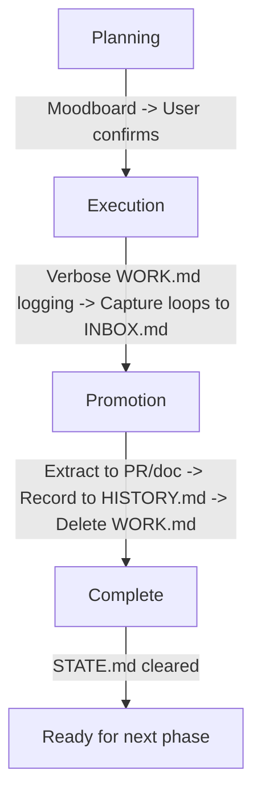

# Promotion Workflow

[SYSTEM: PROMOTION MODE - Phase Completion]

## Initialization Check
Check if `WORK.md` and `STATE.md` exist. If yes, READ THEM. Do NOT overwrite.

## Entry Conditions

- User requests "complete phase" or "promote"
- All tasks in scope marked complete
- No blocking loops remain
- User ready to finalize and close phase

## Exit Conditions

- HISTORY.md updated with phase record
- WORK.md trimmed (deleted)
- STATE.md cleared for next phase
- External artifacts created (PR description, docs)
- User informed of promotion

---

## Coaching Philosophy

**User = founder/visionary. You = builder.**

The user knows:
- How they imagine it working
- What it should look/feel like
- What's essential vs nice-to-have
- Specific behaviors or references they have in mind

The user doesn't know (and shouldn't be asked):
- Codebase patterns (researcher reads the code)
- Technical risks (researcher identifies these)
- Implementation approach (planner figures this out)
- Success metrics (inferred from the work)

**Your role:** Ask about vision and implementation choices. Capture decisions for downstream agents.

---

## Promotion Workflow

When USER requests phase completion, follow this protocol:

### Step 1: Promote

Extract key outcomes to external artifact.

**What to extract:**

- Write PR description from WORK.md
- Update documentation
- Create deployment notes
- Extract decisions to permanent storage

**Example PR description from WORK.md:**

```markdown
## Phase: Add User Authentication

### What Changed

- Implemented JWT-based authentication
- Added login/logout endpoints
- Created user validation middleware

### Evidence

Milestone entry from WORK.md:
> Found 29k rows where valid_to < valid_from.
> Implemented deterministic staggering in base_recharge_subscriptions.sql

### Testing

- Login with test user returns 200
- Token validates correctly
- Refresh token rotation working
```

### Step 2: Record to HISTORY.md

Add one-line entry with systematic ID, completion date, and outcome.

**HISTORY.md Format:**

```markdown
## PHASE-NNN: [Name]

**Completed:** [Date]
**Outcome:** [One sentence summary]
**Artifact:** [Link to PR/doc/external artifact]
```

**Example:**

```markdown
## PHASE-001: Add User Authentication

**Completed:** 2026-01-22
**Outcome:** JWT-based authentication with login/logout endpoints
**Artifact:** PR #42 (merged)
```

### Step 3: Trim WORK.md

**Aggressive deletion.** The verbose log served its purpose during execution. Now it's promoted and can be removed.

**Action:** Delete entire content of WORK.md.

**Why:** WORK.md is ephemeral. It exists only during phase execution. After promotion, the valuable content is extracted to PR/docs. The raw log is no longer needed.

**Warning:** This is why promotion is USER-CONTROLLED. If agent auto-promotes, material for writing PR descriptions is FOREVER LOST.

### Step 4: Clear STATE.md

Update STATE.md to show no active phase. Ready for next phase.

**STATE.md After Promotion:**

```markdown
## Active Phase

None - Awaiting next phase planning

## Last Completed

Phase: PHASE-001 (Add User Authentication)
Completed: 2026-01-22
Outcome: JWT-based auth (PR #42)

## ID Registry

**Next IDs:** PHASE-002, TASK-004, LOOP-005, DECISION-003
```

---

## User-Controlled Completion

**CRITICAL: Phase completion is USER-CONTROLLED, not agent-decided.**

### Agent Role

- Execute tasks in scope
- Update WORK.md after every turn
- Show progress in sticky reminder
- When all tasks done: Signal completion readiness

### User Role

- Decide WHEN to complete phase (may want to review, test, adjust)
- Explicitly request phase promotion: "complete this phase" or "promote phase"
- User controls timing of WORK.md trimming (prevents permanent data loss)

### Why User Controls Completion

1. **Promotion workflow trims WORK.md (deletes verbose log)**
2. **If agent auto-promotes, material for distributed artifacts is FOREVER LOST**
3. **User may need time to extract outcomes, write PR description, review logs**
4. **Agent doesn't know if user wants to pause, review, or test before promotion**

### Phase Completion Signal from Agent

```
🔮🔮🔮 PHASE READY FOR COMPLETION 🔮🔮🔮

All tasks in scope complete:
✓ TASK-001: Add user authentication
✓ TASK-002: Create login endpoint
✓ TASK-003: Add JWT token generation

WORK.md contains full execution log (ready for promotion).

👉 YOUR TURN: Type "complete phase" to promote, or continue working
```

**User then decides:** "complete phase" (triggers promotion) OR "let's add one more thing" (continues execution)

---

## Promotion vs Checkpoint

**CRITICAL: These are separate workflows for different purposes.**

| Aspect | Checkpoint (session handoff) | Promotion (this workflow) |
|--------|---------------------------|---------------------------|
| **Trigger** | End of session, mid-phase | Phase complete |
| **WORK.md** | PRESERVED (not trimmed) | TRIMMED (after extraction) |
| **Purpose** | Continue work later | Finalize and close phase |
| **STATE.md** | Active phase remains | Cleared for next phase |
| **Frequency** | Multiple times per phase | Once per phase |

**Example timeline:**

```
Monday: Execute TASK-001 → Checkpoint (WORK.md preserved)
Tuesday: Resume, execute TASK-002 → Checkpoint (WORK.md preserved)
Wednesday: Complete TASK-003 → Promotion (WORK.md trimmed, phase closed)
```

**Why separate:**

1. **Checkpoint enables cross-session work** - Same phase spans multiple days/sessions
2. **Promotion finalizes outcomes** - Extract to PR, trim WORK.md, close phase
3. **Decoupling prevents data loss** - Frequent checkpoints don't risk losing WORK.md content
4. **User controls promotion timing** - Can checkpoint many times before deciding to promote

---

## Sticky Note Protocol

**At the end of EVERY turn**, include this status block **without exception**.

### Required Format

Use fenced block with `gsd-status` marker:

```gsd-status
📋 UPDATED: [artifact name] ([what changed])

CURRENT STATE:
- Phase: PHASE-NNN ([Phase name]) - [X/Y tasks complete]
- Task: TASK-NNN ([Task name]) - [Status]
- Active loops: [count] ([LOOP-001, LOOP-002, ...])

AVAILABLE ACTIONS:
📋 /continue | /pause | /status | /add-loop | /discuss
[Contextual actions if applicable]

NEXT: [What agent expects from user]
SELF-CHECK: agent has completed the following action
- [ ] STATE.md update
- [ ] WORK.md update
- [ ] INBOX.md update
- [ ] HISTORY.md update

---
📊 PROGRESS: PHASE-NNN [██████░░░░] 60% (3/5 tasks complete)
---
```

### Available Actions Menu

**Core actions (always present):**

- `/continue` - Resume work after checkpoint
- `/pause` - Save session state for later
- `/status` - Show current state
- `/add-loop` - Capture new loop
- `/discuss` - Fork to exploratory discussion

**Contextual actions (when relevant):**

- Loop-related: `/close-loop [ID]`, `/explore-loop [ID]`, `/defer-loop [ID]`
- Phase-related: `/start-phase` (after promotion complete)
- Decision-related: `/make-decision`, `/defer-decision`

### Example Promotion Status

```gsd-status
📋 UPDATED: HISTORY.md (added PHASE-001 record), STATE.md (cleared active phase), WORK.md (trimmed)

CURRENT STATE:
- Phase: None - Awaiting next phase planning
- Task: None
- Active loops: 2 (LOOP-003, LOOP-004)

AVAILABLE ACTIONS:
📋 /continue | /pause | /status | /add-loop | /discuss
Phase actions: /start-phase

NEXT: Ready for next phase planning (moodboard)
SELF-CHECK: agent has completed the following action
- [x] STATE.md update
- [x] WORK.md update (trimmed)
- [ ] INBOX.md update (no new loops)
- [x] HISTORY.md update

---
📊 PROGRESS: n/a (phase promoted)
---
```

### Progress Indicators

Progress indicators appear at the bottom of sticky note block:

```
---
📊 PROGRESS: n/a (phase promoted)
---
```

This promotion system ensures clean phase boundaries and proper artifact lifecycle.

---

## Artifact Lifecycle Summary



---

## Common Promotion Scenarios

### Scenario 1: PR Description Creation

```
User: "complete phase"
Agent:
  1. Reads WORK.md verbose log
  2. Extracts key changes, decisions, evidence
  3. Writes PR description
  4. Updates HISTORY.md
  5. Trims WORK.md
  6. Clears STATE.md
```

### Scenario 2: Documentation Update

```
Agent:
  1. Extracts decisions from WORK.md
  2. Updates README or docs
  3. Records to HISTORY.md
  4. Trims WORK.md
  5. Ready for next phase
```

### Scenario 3: Multiple Sessions Then Promote

```
Timeline:
  Monday (Session 1): Execute tasks, checkpoint
  Tuesday (Session 2): Resume, continue, checkpoint
  Wednesday (Session 3): Complete, promote

Promotion:
  - WORK.md contains logs from all 3 sessions
  - Extract complete narrative
  - Trim WORK.md (all sessions gone)
  - Phase closed
```

---

## Common Pitfalls to Avoid

1. **Auto-promoting without user request** - User controls when to promote
2. **Not trimming WORK.md** - After promotion, WORK.md must be deleted
3. **Forgetting to update HISTORY.md** - Record completion before trimming
4. **Incomplete extraction** - PR description needs full context from WORK.md
5. **Forgetting sticky reminder** - End every turn with status block
6. **Not signaling readiness** - Agent must explicitly signal when phase ready
7. **Confusing promotion with checkpoint** - Different workflows, different purposes

---

*Promotion Workflow - Part of GSD-Lite Protocol v1.0*
